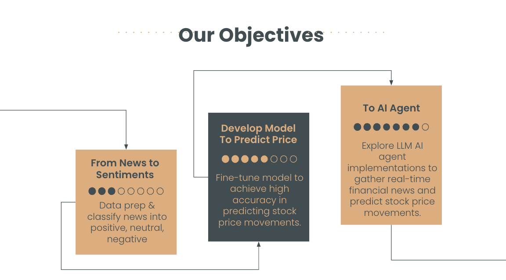
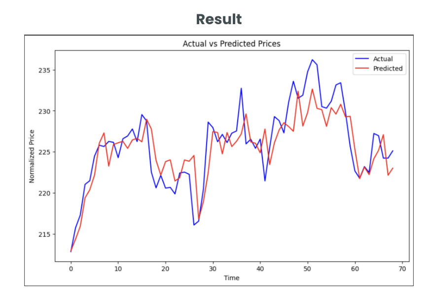

# AI-Driven Financial News Analysis  

## Overview  
This project focuses on **predicting stock price movements using AI-driven financial news analysis**. By integrating **financial news sentiment analysis** with stock market data, the system aims to support **investment research and trading decisions**.  

## Objectives  
- **News Sentiment Analysis**: Classify financial news as **positive, neutral, or negative**.  
- **Stock Price Prediction**: Train AI models to predict **stock movements for the next 5 days**.  
- **AI Agent Development**: Implement an AI-driven model to analyze real-time financial news.

## Data Collection  
- **Financial News Sources:**  
  - Yahoo Finance API  
  - Alpha Vantage Global News API  
  - NewsAPI  
  - Reuters Business & Financial News API  
  - Finnhub API  

- **Stock Price Data:**  
  - Collected from **Yahoo Finance API**.  

### Data Processing  
- Fetched **1 year of financial news and stock price data**.  
- Implemented **data looping and sleep intervals** to handle API request limits.  

## Models Used  
### **Supervised Classification & Regression Models**  
- **Linear Regression**: Simple, interpretable model for stock movement predictions.  
- **SVM (Support Vector Machine)**: Classifies stock price movement trends.  
- **ARIMA Model**: Time-series forecasting for short-term stock price changes.  
- **Neural Network**:  
  - **CNN Layer**: Extracts key features from financial news.  
  - **LSTM Layer**: Captures time-series dependencies.  
  - **Dense Layer**: Outputs final predictions.  

- **Transformer Model (T5 Small)**:  
  - Used for extracting insights from news to **generate stock price predictions**.  
  - Pros: **Lightweight and pretrained**.  
  - Cons: **Lower accuracy for complex tasks**.  

## Results & Limitations  
- **Best Directional Accuracy Achieved: 66.67%**.  
- Challenges:  
  - Limited training data.  
  - Predictions lagged behind actual market changes.  
  - More tuning needed for **optimizers and activation functions**.

## Business Impact  
- **Supports investment research and trading decisions**.  
- **Identifies negative sentiment** to prevent potential losses.  
- **Improves trading, portfolio management, and risk assessment**.  

## Future Work  
- Improve model accuracy with **larger datasets** and **hyperparameter tuning**.  
- Implement **real-time financial news analysis** for dynamic predictions.  
- Explore **LLM-based AI agents** for enhanced stock market insights.  

